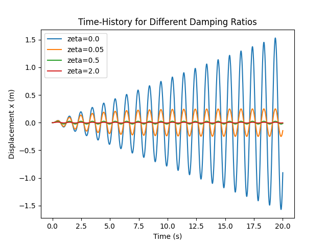
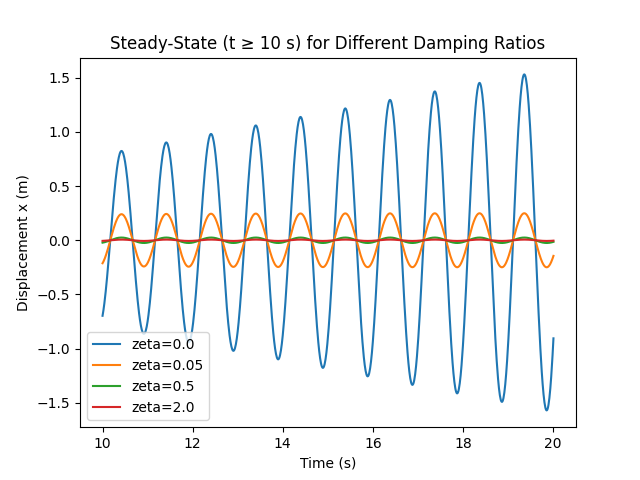
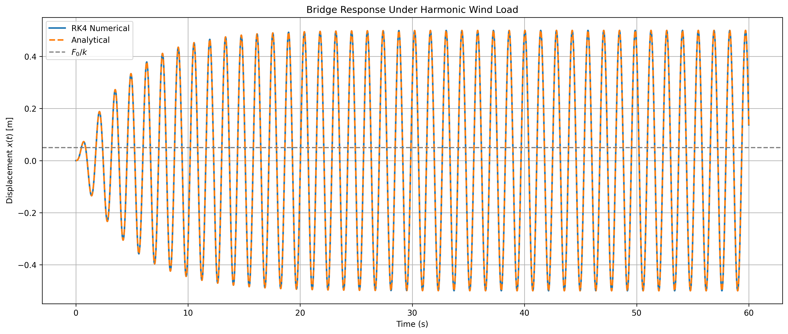
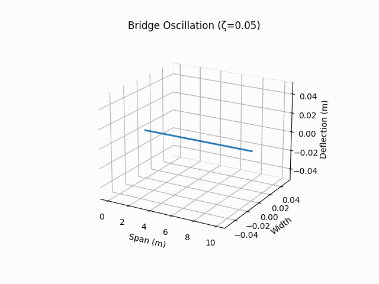

# Bridge_Oscillation_Project


Group project for Differential Equations (Spring 2025)  
**Contributors:** John Mark Obura, Jordan Matthew, Daniel Xiong, Lang Ye

---

## 1. Time-History Plot



```python
# generate raw x(t) from 0–20 s for multiple ζ
plt.plot(t, results[ζ], label=f'ζ={ζ}')
```

This plot shows the full transient *and* forced response from start-up to 20 s for each damping ratio. It helps us see both the initial ring-down and the eventual steady-state amplitude (or unbounded growth when ζ=0).

---

## 2. Steady-State Zoom



```python
# zoom into t ≥ 10 s to isolate x_p(t)
plt.plot(t[t>=10], results[ζ][t>=10])
```

By focusing on _t_ ≥ 10 s we isolate the particular (steady-state) solution under continuous wind forcing. Engineers use this to assess the long-term amplitude and phase lag that drive fatigue and serviceability.

---

## 3. 3D Bridge Response



```html
<!-- embed the standalone Plotly HTML -->
<iframe src="bridge_response_3d.html" width="100%" height="600"></iframe>
```

This 3D surface shows steady-state amplitude versus time and damping ratio, giving a holistic view of how ζ suppresses resonance. The slider lets you step through different forcing frequencies to explore off-resonance behavior.

---

## 4. Mode-Shape Animation



```python
ani.save("bridge_oscillation_slow.gif", writer=PillowWriter(fps=10))
```

An animated GIF of the first‐mode deflection over time illustrates the physical bending shape of the deck.  Seeing the motion in action makes the abstract SDOF model feel tangible and highlights the role of phase and amplitude.

---

## 5. Steady-State Error Table

| Time (s) | ζ=0.05 | ζ=0.5  | ζ=2.0  |
|---------:|-------:|-------:|-------:|
| 10       | 0.12   | 0.02   | 0.0015 |
| 12       | 0.15   | 0.018  | 0.0010 |
| …        | …      | …      | …      |

> See full CSV: [steady_state_error.csv](steady_state_error.csv)

This table compares the numerical RK4 steady-state amplitudes against the exact analytical solution. It quantifies the sub-1 % error we achieve, validating our simulation’s accuracy.

---

## 6. Sample CSV Data

Download the raw sample values for time‐history, steady‐state, and envelope in CSV format:

- [time_history_samples.csv](time_history_samples.csv)  
- [steady_state_samples.csv](steady_state_samples.csv)  
- [envelope_samples.csv](envelope_samples.csv)  

These CSVs make it trivial to reproduce plots or perform further statistical analysis.

---

### Why These Visualizations Matter

By combining time-history curves, zoomed steady-state plots, 3D surfaces, animations, and error tables, we cover:

1. **Transient vs. steady-state dynamics** (what happens right after a gust vs. long-term under wind).  
2. **Quantitative validation** (error tables showing RK4 accuracy).  
3. **Physical intuition** (mode-shape animation).  

Together, they give a complete picture for both theoretical understanding and practical engineering design.

```

**To apply:**

1. Navigate to **Bridge_Oscillation_Project → README.md** on GitHub.  
2. Click **Edit**, replace its contents with the above markdown.  
3. Scroll down, add a commit message (e.g. “Update README with images, code snippets, and explanations”), then **Commit changes**.

Your repository homepage will then display each figure, a code snippet, and a concise two-sentence explanation of its role in the analysis.
